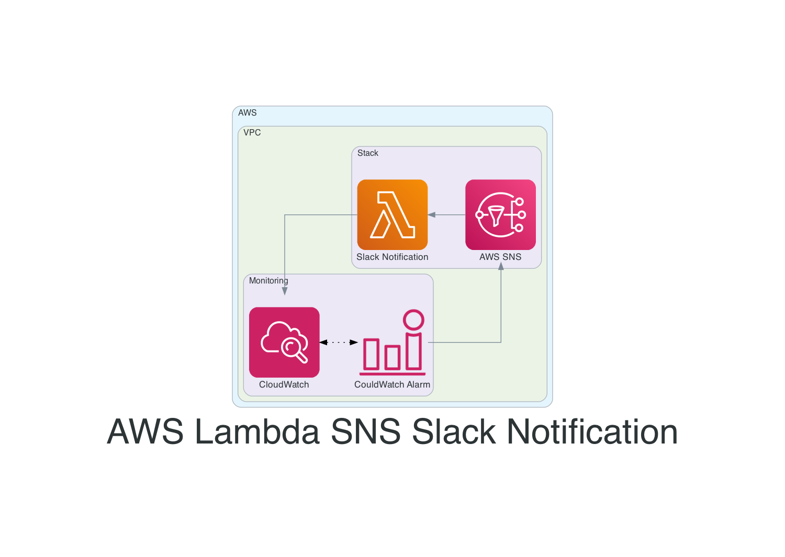

# AWS Lambda SNS Slack Notification

## Tabela de Conteúdos

1. [Terraform App](./app/README.md#AWS-Lambda-SNS-Slack-Notification)
   1. [Requirements](./app/README.md#Requirements)
   2. [Providers](./app/README.md#Providers)
   3. [Modules](./app/README.md#Modules)
   4. [Resources](./app/README.md#Resources)
   5. [Inputs](./app/README.md#Inputs)
   6. [Outputs](./app/README.md#Outputs)
2. [Deployment](./deployment/README.md)
   1. [Requirements](./deployment/README.md#Requirements)
   2. [Good to have](./deployment/README.md#Good-to-have)
   3. [Estrutura do Projeto](./deployment/README.md#Estrutura-do-Projeto)
   4. [Diretório App](./deployment/README.md#Diretório-App)
   5. [Diretório Deployment](./deployment/README.md#Diretório-Deployment)
   6. [Deployando a Aplicação](./deployment/README.md#Deployando-a-Aplicação)
   7. [TerraGrunt Init](./deployment/README.md#TerraGrunt-Init)
   8. [TerraGrunt Plan](./deployment/README.md#TerraGrunt-Plan)
   9. [TerraGrunt Apply](./deployment/README.md#TerraGrunt-Apply)
   10. [Todos os comandos juntos](./deployment/README.md#Todos-os-comandos-juntos)
3. [Utilização e Tests](./USAGE.md#Utilização-e-Teste)
   1. [Como Testar a Lambda](./USAGE.md#Como-Testar-a-Lambda)
   2. [Exemplos do Json SNS Topic](./USAGE.md#Exemplos-do-Json-SNS-Topic)
   3. [Executando o Teste](./USAGE.md#Executando-o-Teste)
   4. [Logs da Lambda](./USAGE.md#Logs-da-Lambda)

## Diagrama

SRE Team
