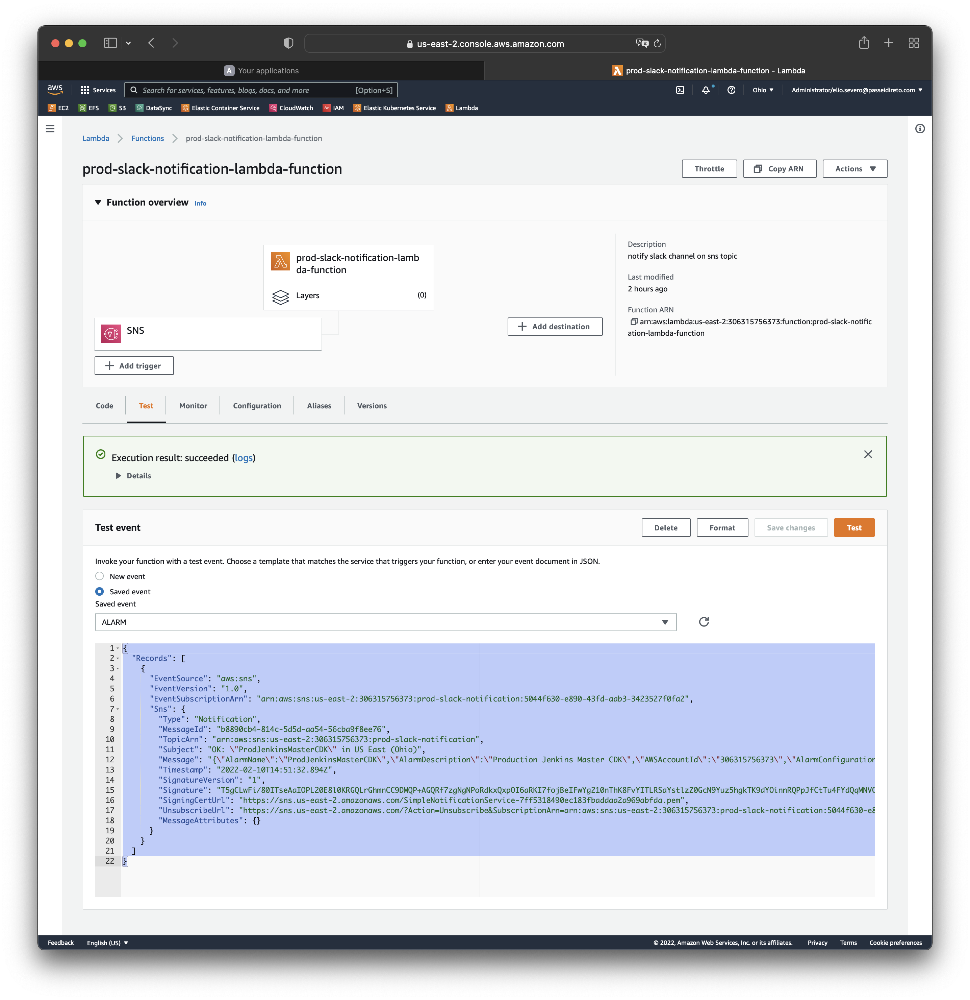
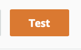
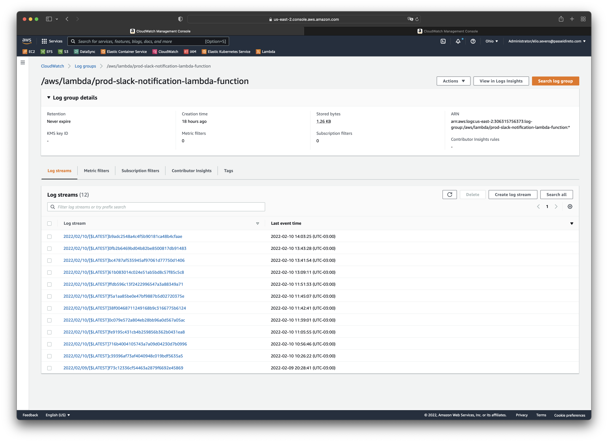
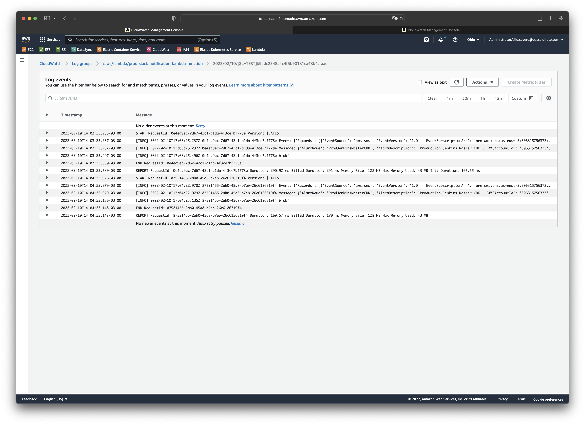

# Utilização e Teste

## Como Testar a Lambda

Vá até **[prod-slack-notification-lambda-function](https://us-east-2.console.aws.amazon.com/lambda/home?region=us-east-2#/functions/prod-slack-notification-lambda-function?tab=testing)** na conta `Founders`
Escolha o json com o referido alarm para testar abaixo.

### Exemplos do Json SNS Topic

`In ALARM Topic Json Message`

```json
{
  "Records": [
    {
      "EventSource": "aws:sns",
      "EventVersion": "1.0",
      "EventSubscriptionArn": "arn:aws:sns:us-east-2:306315756373:prod-slack-notification:5044f630-e890-43fd-aab3-3423527f0fa2",
      "Sns": {
        "Type": "Notification",
        "MessageId": "b8890cb4-814c-5d5d-aa54-56cba9f8ee76",
        "TopicArn": "arn:aws:sns:us-east-2:306315756373:prod-slack-notification",
        "Subject": "ALARM: \"ProdJenkinsMasterCDK\" in US East (Ohio)",
        "Message": "{\"AlarmName\":\"ProdJenkinsMasterCDK\",\"AlarmDescription\":\"Production Jenkins Master CDK\",\"AWSAccountId\":\"306315756373\",\"AlarmConfigurationUpdatedTimestamp\":\"2022-02-10T14:50:50.382+0000\",\"NewStateValue\":\"ALARM\",\"NewStateReason\":\"Threshold Crossed: 0 out of the last 1 datapoints [1.0 (10/02/22 14:49:00)] was less than the threshold (0.0) (minimum 1 datapoint for OK -> ALARM transition).\",\"StateChangeTime\":\"2022-02-10T14:51:32.839+0000\",\"Region\":\"US East (Ohio)\",\"AlarmArn\":\"arn:aws:cloudwatch:us-east-2:306315756373:alarm:ProdJenkinsMasterCDK\",\"OldStateValue\":\"OK\",\"OKActions\":\"[arn:aws:sns:us-east-2:306315756373:prod-slack-notification]\",\"AlarmActions\":\"[arn:aws:sns:us-east-2:306315756373:prod-slack-notification]\",\"InsufficientDataActions\":\"\",\"Trigger\":{\"MetricName\":\"DesiredTaskCount\",\"Namespace\":\"ECS/ContainerInsights\",\"StatisticType\":\"Statistic\",\"Statistic\":\"AVERAGE\",\"Unit\":null,\"Dimensions\":[{\"value\":\"jenkins-master-cdk\",\"name\":\"ServiceName\"},{\"value\":\"jenkins-master-cdk\",\"name\":\"ClusterName\"}],\"Period\":60,\"EvaluationPeriods\":1,\"DatapointsToAlarm\":1,\"ComparisonOperator\":\"LessThanThreshold\",\"Threshold\":2.0,\"TreatMissingData\":\"missing\",\"EvaluateLowSampleCountPercentile\":\"\"}}",
        "Timestamp": "2022-02-10T14:51:32.894Z",
        "SignatureVersion": "1",
        "Signature": "T5gCLwFi/80ITseAaIOPL20E8l0KRGQLrGhmnCC9DMQP+AGQRf7zgNgNPoRdkxQxpOI6aRKI7fojBeIFwYg210nThK8FvYITLRSaYstlzZ0GcN9Yuz5hgkTK9dYOinnRQPpJfCtTu4FYdQqMNVCVLFkjzc6R0M7QM2Le1b4rdGIpEfVjuhOs97HAl8H7+XGYBH7+7ZCHm5sTPh96EoRMA5LmHeIbIknJveODQC78a3yS9W68Rya9MpwzQkd9rVornKlxTXrIv2EO9EeMSrcAAM6xFtWK0taO0PHzhLhhMa7HQ2o8tKrlzL+G+lbZ0IMeG8wxsXwgmK0MhdaNVhpKTg==",
        "SigningCertUrl": "https://sns.us-east-2.amazonaws.com/SimpleNotificationService-7ff5318490ec183fbaddaa2a969abfda.pem",
        "UnsubscribeUrl": "https://sns.us-east-2.amazonaws.com/?Action=Unsubscribe&SubscriptionArn=arn:aws:sns:us-east-2:306315756373:prod-slack-notification:5044f630-e890-43fd-aab3-3423527f0fa2",
        "MessageAttributes": {}
      }
    }
  ]
}
```

`OK Topic Json Message`

```json
{
  "Records": [
    {
      "EventSource": "aws:sns",
      "EventVersion": "1.0",
      "EventSubscriptionArn": "arn:aws:sns:us-east-2:306315756373:prod-slack-notification:5044f630-e890-43fd-aab3-3423527f0fa2",
      "Sns": {
        "Type": "Notification",
        "MessageId": "b8890cb4-814c-5d5d-aa54-56cba9f8ee76",
        "TopicArn": "arn:aws:sns:us-east-2:306315756373:prod-slack-notification",
        "Subject": "OK: \"ProdJenkinsMasterCDK\" in US East (Ohio)",
        "Message": "{\"AlarmName\":\"ProdJenkinsMasterCDK\",\"AlarmDescription\":\"Production Jenkins Master CDK\",\"AWSAccountId\":\"306315756373\",\"AlarmConfigurationUpdatedTimestamp\":\"2022-02-10T14:50:50.382+0000\",\"NewStateValue\":\"OK\",\"NewStateReason\":\"Threshold: 1 last 1 datapoints [1.0 (10/02/22 14:49:00)] was less than the threshold (1.0) (minimum 1 datapoint for OK -> ALARM transition).\",\"StateChangeTime\":\"2022-02-10T14:51:32.839+0000\",\"Region\":\"US East (Ohio)\",\"AlarmArn\":\"arn:aws:cloudwatch:us-east-2:306315756373:alarm:ProdJenkinsMasterCDK\",\"OldStateValue\":\"OK\",\"OKActions\":\"[arn:aws:sns:us-east-2:306315756373:prod-slack-notification]\",\"AlarmActions\":\"[arn:aws:sns:us-east-2:306315756373:prod-slack-notification]\",\"InsufficientDataActions\":\"\",\"Trigger\":{\"MetricName\":\"DesiredTaskCount\",\"Namespace\":\"ECS/ContainerInsights\",\"StatisticType\":\"Statistic\",\"Statistic\":\"AVERAGE\",\"Unit\":null,\"Dimensions\":[{\"value\":\"jenkins-master-cdk\",\"name\":\"ServiceName\"},{\"value\":\"jenkins-master-cdk\",\"name\":\"ClusterName\"}],\"Period\":60,\"EvaluationPeriods\":1,\"DatapointsToAlarm\":1,\"ComparisonOperator\":\"LessThanThreshold\",\"Threshold\":2.0,\"TreatMissingData\":\"missing\",\"EvaluateLowSampleCountPercentile\":\"\"}}",
        "Timestamp": "2022-02-10T14:51:32.894Z",
        "SignatureVersion": "1",
        "Signature": "T5gCLwFi/80ITseAaIOPL20E8l0KRGQLrGhmnCC9DMQP+AGQRf7zgNgNPoRdkxQxpOI6aRKI7fojBeIFwYg210nThK8FvYITLRSaYstlzZ0GcN9Yuz5hgkTK9dYOinnRQPpJfCtTu4FYdQqMNVCVLFkjzc6R0M7QM2Le1b4rdGIpEfVjuhOs97HAl8H7+XGYBH7+7ZCHm5sTPh96EoRMA5LmHeIbIknJveODQC78a3yS9W68Rya9MpwzQkd9rVornKlxTXrIv2EO9EeMSrcAAM6xFtWK0taO0PHzhLhhMa7HQ2o8tKrlzL+G+lbZ0IMeG8wxsXwgmK0MhdaNVhpKTg==",
        "SigningCertUrl": "https://sns.us-east-2.amazonaws.com/SimpleNotificationService-7ff5318490ec183fbaddaa2a969abfda.pem",
        "UnsubscribeUrl": "https://sns.us-east-2.amazonaws.com/?Action=Unsubscribe&SubscriptionArn=arn:aws:sns:us-east-2:306315756373:prod-slack-notification:5044f630-e890-43fd-aab3-3423527f0fa2",
        "MessageAttributes": {}
      }
    }
  ]
}
```

### Executando o Teste

Cole o Json na área de texto como selecionado na imagem abaixo



Click no Botão de `Teste`



Aguarde a Execução.

Verifique os [Logs](https://us-east-2.console.aws.amazon.com/cloudwatch/home?region=us-east-2#logsV2:log-groups/log-group/$252Faws$252Flambda$252Fprod-slack-notification-lambda-function)

Nota:
> Os Log Groups podem variar entre contas de acordo com a variáveis de deployment fornecidas ao terraform.</br>
> Fique atento e juste os valores quando necessário.

## Logs da Lambda

Exemplo de Logs da Lambda:





Nota:

> O [Alarm](https://us-east-2.console.aws.amazon.com/cloudwatch/home?region=us-east-2#alarmsV2:alarm/ProdJenkinsMasterCDK?~(search~'Jenkin)) foi e deverá ser criado manualmente. </br> 
> Está automação ainda não faz parte deste projeto de IaC com Terraform.
